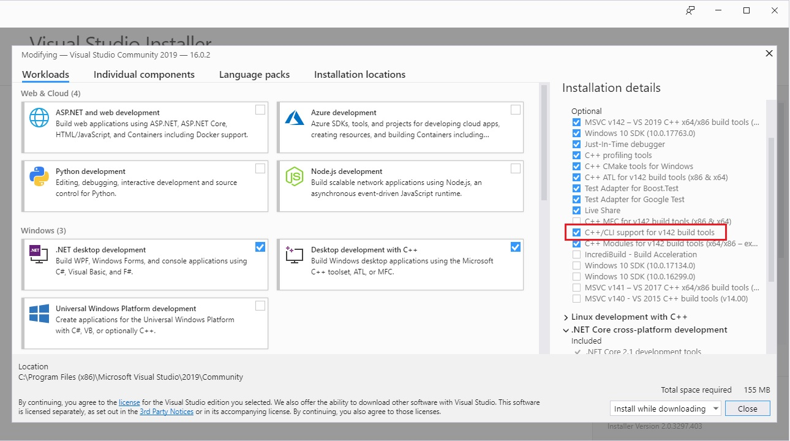

IPSSclr_2015.sln
	- Giới thiệu giải thuật đọc biển số xe máy
	- Để build được Debug mode các bạn phải cài đặt Visual Studio 2015 trở lên. Khi cài đặt nhớ chọn C++/CLI như trong hình
	
	

IPSScar_VS2015.sln
	Giới thiệu giải thuật cơ bản để đọc biển số xe hơi (loại dài) ở Việt Nam

